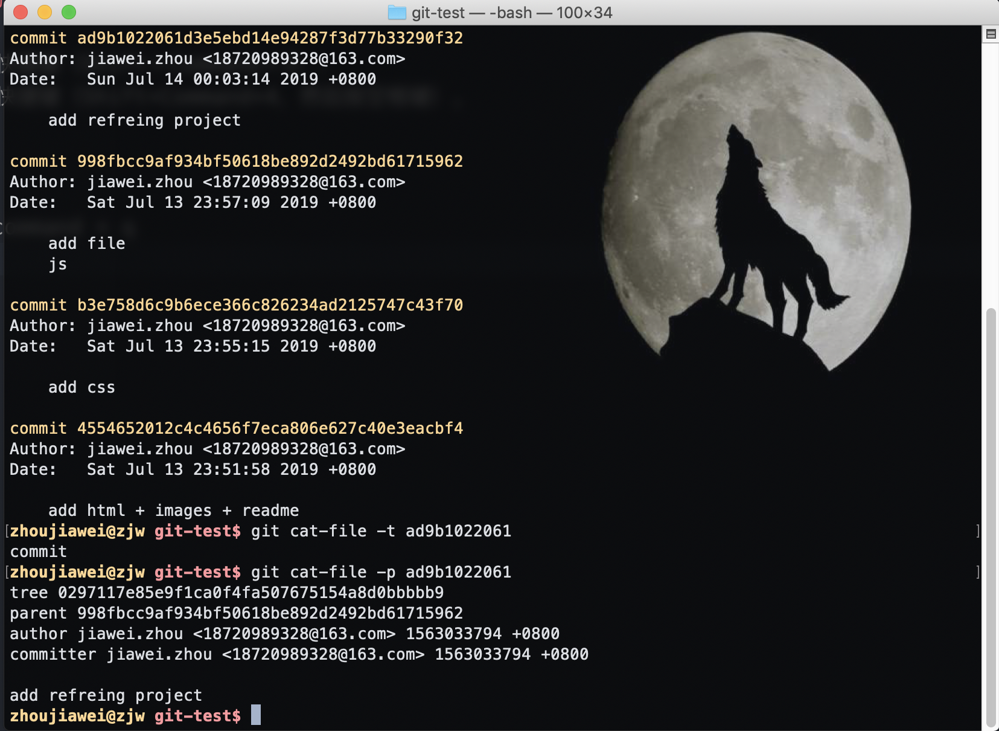
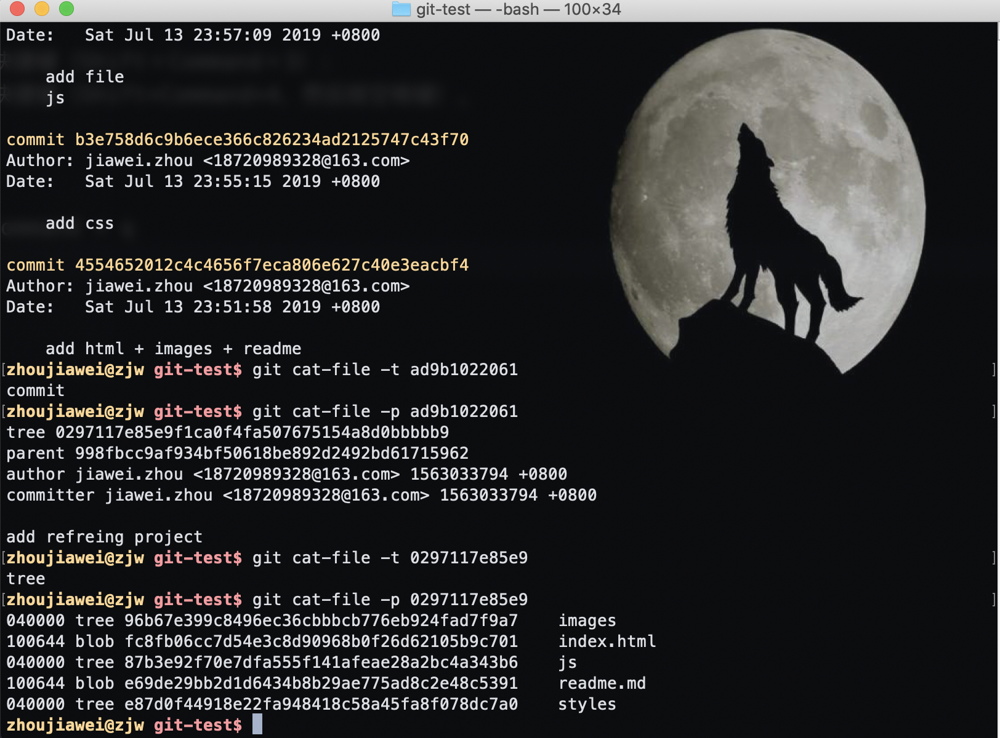
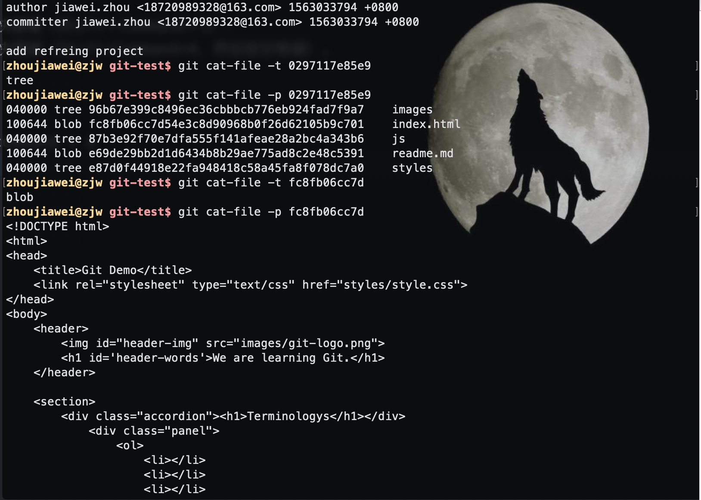
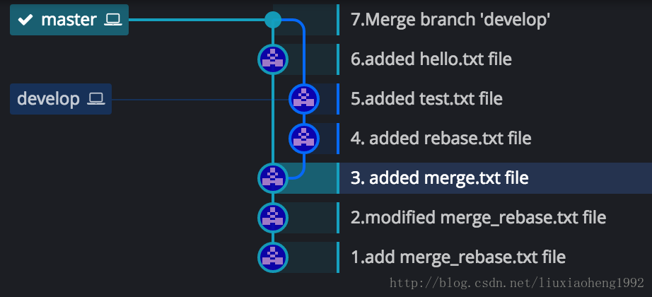
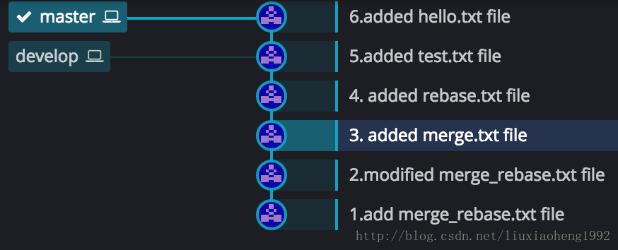
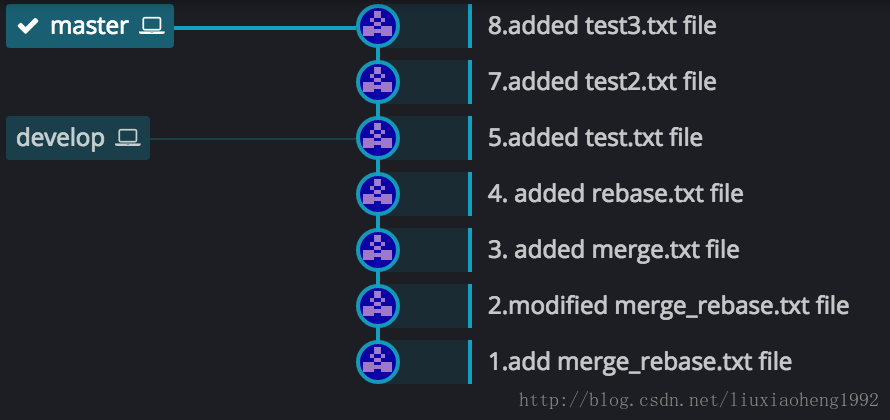
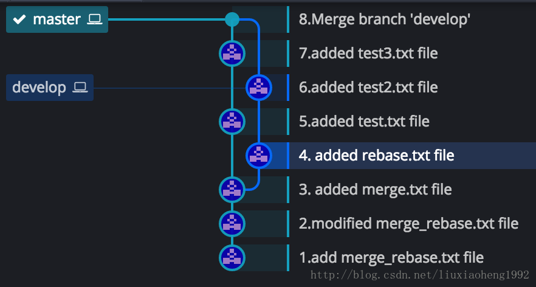

## 安装


[Git 官方文档地址](https://git-scm.com/book/zh/v2)

[macOS 平台 Git 下载地址](https://git-scm.com/download/mac)

[window 平台 Git 下载地址](https://git-scm.com/download/win)

[linux 平台 Git 下载地址](https://git-scm.com/download/linux)

macOS 如果从网址上下不下来可以通过 homebrew 安装git

1. 安装homebrew： `/usr/bin/ruby -e "$(curl -fsSL https://raw.githubusercontent.com/Homebrew/install/master/install)`；
2. 安装git：brew install git。

注意：

1. 不要安装在中文目录
2. 不要使用桌面管理软件

安装很简单，一直下一步即可。在任意的目录下右键，能看到菜单, 就表示安装成功了。

使用git的两种方式

1. git gui，即图形化界面的方式
2. git bash，命令行的方式（推荐）

## 使用 git 之前的配置

**配置 user 信息**:

* 配置 user.name：git config --global user.name 'your_name'
* 配置 user.email：git config --global user.email 'your_email@domain.com'

**config 的三个作用域：**

```shell
git config --local ##只对某个仓库有效,切换到另外一个仓库失效
git config --global ##当前用户的所有仓库有效,工作当中最常用
git config --system ##系统的所有用户,几乎不用
```

**查看配置:**

```shell
git config --list --local ##只能在仓库里面起作用, 普通路径git不管理
git config --list --global
git config --list --system
```

**清除配置：**

```shell
git config --unset --local user.name
git config --unset --global user.name
git config --unset --system user.name
```

**配置信息所在文件：**

* local的在.git/config里面；
* global的在个人home目录下的.gitconfig里面；
* system应该在git安装目录的下

**优先级：**

local > global > system

## 创建 git 仓库

两种⽅方式:

1、⽤用 Git 之前已经有项⽬目代码

```shell
cd 项⽬目代码所在的⽂文件夹
git init
```

2、⽤用 Git 之前还没有项⽬目代码

```shell
cd 某个⽂文件夹
git init your_project #会在当前路路径下创建和项⽬目名称同名的⽂文件夹
cd your_project
```

## git三个区

**git仓库会分成三个区：**

* 工作区：我们书写代码的地方，工作的目录就叫工作区。
* 暂存区：暂时存储的区域，在git中，代码无法直接从工作区提交到仓库区，而是需要先从工作区添加到暂存区，然后才能从暂存区提交到仓库区。
* 本地仓库区：将保存在暂存区域的内容永久转储到 Git 仓库中，生成版本号。生成版本号之后，就可以任何的回退到某一个具体的版本。

**使用 git status 查看工作区文件状态：**

* 红色表示工作区中的文件需要提交；
  * 如果显示 `Untracked files:` 说明该文件是新增的，没有被 git 管理到。
  * 如果没有显示 `Untracked files:` 说明该文件是修改或删除的，被 git 管理到。
* 绿色表示暂存区中的文件需要提交；

**使用 git add 命令提交工作区文件到暂存区：**

* `git add .`：将工作空间所有的文件添加的暂存区
* `git add -u`：将工作空间被修改和被删除的文件添加到暂存区(不包含没有纳入Git管理的新增文件)

**使用 git commit 命令将暂存区文件提交到仓库：**

git commit作用：是将文件由 暂存区 添加到 仓库区，生成版本号。

* git commit -m "提交说明"；
* git commit： 如果不写提交说明，会进入vi编辑器，没有写提交说明，是提交不成功的。
* git commit --amend -m "提交说明"：修改最近的一次提交说明， 如果提交说明不小心输错了，可以使用这个命令。不写 -m 也会进入 vi 编辑器，并且 vi 编辑器中的内容是上次填写的内容。

## 给文件重命名的简便方法

直接对文件名字修改 git 会显示的信息是先删除老文件，再新增你命名的文件。

**git mv 源文件名 目标文件名**：该命令会直接将暂存区的文件名字进行修改，这样就不需要 git add 再次提交文件了。

## 查看版本历史信息

作用：查看提交日志

* git log 查看当前分支的历史信息
* git log --all 查看所有分支的历史
* git log --all --graph 查看图形化的 log 地址
* git log --oneline 查看当前分支的简洁历史。
* git log --oneline -n4 查看最近的四条简洁历史。
* git log --oneline --all -n4 --graph 查看所有分支最近 4 条单行的图形化历史。
* git log 分支名 查看指定分支名的历史信息
* git help --web log 跳转到git log 的帮助文档网页

* `git log` 查看提交的日志
* `git log --oneline` 简洁的日志信息
* `git reflog` 可以查看所有的操作日志 (可以查看所有版本号)

## 添加 tag 版本信息

**查看标签：**

* git tag 查看所有标签；
* `git tag -l <版本号>` 打印符合检索条件的标签，如 git tag -l 1.*.* 为搜索一级版本为1的版本。

**创建本地标签：**

* `git tag <版本号>-light`：创建轻量标签，轻量标签指向一个发行版的分支，其只是一个像某commit的引用，不存储名称时间戳及标签说明等信息。
* `git tag -a <版本号> -m "<备注信息>"`：创建带附注标签，相对于轻量标签，附注标签是一个独立的标签对象，包含了名称时间戳以及标签备注等信息，同时指向对应的commit。
* `git tag -a <版本号> <SHA值> -m "<备注信息>"`：给特定的commit添加标签，使用该commit对应的SHA值即可。

**删除本地标签：**

git tag -d <版本号>

**将本地标签提交到远程仓库：**

前面所提到的创建标签，只是将标签添加到了本地的版本管理，我们需要在创建之后将本地标签同步到远程仓库，如Github。

* `git push origin --tags`： 推送所有标签；
* `git push origin <版本号>`：推送指定版本的标签；

如果刚刚同步上去,你缺发现一个致命bug ,需要重新打版本,现在还为时不晚.

1. 先删除本地标签： git tag -d V1.2；
2. 然后删除线上版本：方式有两种；
   * Git版本 (> v1.7.0) 使用 `git push origin --delete <V1.2>` 删除线上版本；
   * 旧版本Git并没有提供直接删除的方法，而我们可以通过将一个空标签替换现有标签来实现删除标签，git push origin :refs/tags/<V1.2>

**获取远程版本:**

`git fetch origin tag V1.2`

## 探秘 .git 目录

.git 文件夹内有以下内容：

```tree
├── COMMIT_EDITMSG
├── HEAD
├── ORIG_HEAD
├── config
├── description   仓库的描述信息文件
├── hooks
├── index
├── info
├── logs
├── objects
└── refs
```

比较重要的有:

* HEAD: 指向当前所在的分支，例如当前在 develop 分支，实际指向地址是 refs/heads/develop;
* config: 当前 git 的配置文件，如 user.name、user.email;
* objects ：存放对象 .git/objects/ 文件夹中的子文件夹都是以哈希值的前两位字符命名 每个object由40位字符组成，前两位字符用来当文件夹，后38位做文件。如：文件夹名为 02，里面文件名为97117e85e9f1ca0f4fa507675154a8d0bbbbb9 则 使用 git cat-file -t 0297117e85e9f1ca0f4fa507675154a8d0bbbbb9 查看存放的内容
* refs
  * heads :存放当前项目的所有分支。
  * tags 存放的当前项目的所有标签，又叫做里程碑。当这次commit是具有里程碑意义的 比如项目1.0的时候 就可以打tag。

**git cat-file 命令 显示版本库对象的内容、类型及大小信息。**

* cat 命令， 功能：用来显示文件。 例如 cat text.md 显示 text.md 文件的内容
* ls -al 命令， 表示列出当前目录下的所有文件（包括隐藏文件）
* git cat-file -t <文件名> ， 查看 git 对象的类型
* git cat-file -p <文件名>， 查看 git 对象的内容
* git cat-file -s <文件名>， 查看 git 对象的大小

**.git/objects目录下有三种对象类型：commit、tree和blob。三者关系如下：**

* 每次commit 都会创建一个 commit 对象，并且 git 都会将当前项目的所有文件夹及文件快照保存到 ./git/objects 目录下。一个 commit 对象里会包含有 tree（相当于文件夹）、author、committer等信息；
* 一个 tree 对象会包含 tree 和 blob；
* 一个 blob 指的就是具体的文件内容，在 git 中，blob 与文件名无关，即文件内容相同在 git 中是同一个 blob。

下面以具体的实例进行验证：

步骤一：使用git log查看已提交的commit记录，如下图。选取提交历史中的一个commit使用命令git cat-file -p commitId号进行查看，从图中可以看出，一个commit里面含有一个tree(这次commit时期包含的文件内容)。



步骤二：进入到某一具体的tree下面进行查看，继续使用git cat-file -p commitId号  命令，可以看到一个tree下面确实包含有tree和blog。



步骤三：进入到某一具体的blog进行查看，验证是否一个blog代表一个文件内容(进入到具体的blog下，有的blog能直接解析打开，如html，txt等，有的不能，如图片等)。如图所示可以直接看到该blog所对应的index.html的文件内容。



以上就是三者之间的关系。

## 理解头指针和分离头指针

头指针 HEAD 可以指向 branch 也可以指向快照节点。当指向 branch 时，该 branch 是当前工作的分支；当不指向 branch 时则会在一个 detached 状态。

所谓的分离头指针指的是当前工作在没有分支的情况下。

**分离头指针状态：**

执行命令 `git checkout <commit id>`，此时 HEAD指针 指向这个 commit 快照，处于分离头指针状态。在这个状态下修改提交的代码不会提交到正常的分支。

```shell
Note: checking out '952770d'.

You are in 'detached HEAD' state. You can look around, make experimental
changes and commit them, and you can discard any commits you make in this
state without impacting any branches by performing another checkout.

If you want to create a new branch to retain commits you create, you may
do so (now or later) by using -b with the checkout command again. Example:
```

执行命令 `git branch -av` 可以看到多出一个没有名称的分支，并且正工作在其上。

**detached HEAD下的修改：**

在 detached HEAD 状态下修改了文件，并且 commit 了，git commit 会得到如下提示：

```shell
[分离头指针 952770d] git checkout first commit
 1 file changed, 1 insertion(+)
```

952770d为在分离头指针下提交的commit id，这个commit id回到master head是看不到的，回到master 重新执行git checkout 952770d可找回自己的代码，执行git log时也可以看到log；

在分离头指针下当执行git checkout到其他分支时，会收到下面的警告，提示用户要新创建一个分支来保留做的修改:

```shell
警告：您正丢下 1 个提交，未和任何分支关联：

  952770d git checkout first commit

如果您想要通过创建新分支保存它，这可能是一个好时候。
如下操作：

 git branch <新分支名> 952770d
```

要想让这个 commit 生效就得绑定一个分支。执行git branch <新分支名> 952770d创建一个新的分支，这个分支是基于头指针分离下修改提交的952770d创建的。

**分离头指针的应用场景：**

分离头指针的情况下比较危险，因为这个时候你提交的代码没有和分支对应起来，当切换到其他分支的时候(比如master分支)，容易丢失代码。但是这个特性在某些场景下有很大的用处。

如果临时想基于某个commit做变更，试试新方案是否可行，就可以采用分离头指针的方式。测试后发现新方案不成熟，直接切回其他分支即可。省却了建、删分支的麻烦了。

## 分支操作

::: tip
在git中，分支实质上仅仅是一个指针，每次代码提交后，这个分支指针就会向后移动，保证一直指向最后一次提交的的版本，git中使用HEAD指向当前分支。
:::

**查看分支：**

git branch -av：查看所有的分支，当前分支的前面会有一个`*`。

**创建分支：**

* `git branch <分支名称>`，基于当前分支创建一个新分支；
* `git checkout -b 分支名称`，创建并切换分支；
* `git checkout -b 分支名称 commit版本号` ，在该版本上创建一个分支并切换到该分支上。

::: tip
刚创建的git仓库默认的master分支要在第一次commit之后才会真正建立, 之后才能创建分支。
:::

**切换分支：**

* `git checkout 分支名称`切换分支  HEAD指针指向了另一个分支

**删除分支：**

* `git branch -d 分支名称` 可以删除分支

::: tip
不能在当前分支删除当前分支，需要切换到其他分支才能删除。
`master`分支是可以删除的，但是不推荐那么做。
:::

**合并分支：**

* `git merge 分支名称` 将其他分支的内容合并到当前分支；
* `git rebase 分支名称` 将其他分支的内容合并到当前分支；

**merge 和 rebase的区别：**

假设我们有如下图一所示仓库，该仓库有master和develop两个分支，且develop是在（3.added merge.txt file）commit处从master拉出来的分支。


1、使用 merge 合并分支：

假设现在HEAD在（6.added hello.txt file）处，也就是在master分支最近的一次提交处，此时执行git merge develop, 结果如下图所示。



工作原理就是：git 会自动根据两个分支的共同祖先即 (3.added merge.txt file)这个 commit 和两个分支的最新提交即 (6.added hello.txt file) 和 (5.added test.txt file) 进行一个三方合并，然后将合并中修改的内容生成一个新的 commit，即图二的(7.Merge branch ‘develop’)。这是merge的效果，简单来说就合并两个分支并生成一个新的提交。

2、使用 rebase 合并分支：

假设初始状态也是图一所显示的。两个分支一个master，一个develop，此时HEAD在（6.added hello.txt file）处，现在执行git rebase develop,结果如下图三所示。



可以看见develop分支分出来分叉不见了，下面来解释一下它的工作原理：

在执行git rebase develop之前，HEAD在（6.added hello.txt file）处，当执行rebase操作时，git 会从两个分支的共同祖先 (3.added merge.txt file)开始提取 当前分支（此时是master分支）上的修改，即 （6.added hello.txt file）这个commit，再将 master 分支指向 目标分支的最新提交（此时是develop分支）即（5.added test.txt file） 处，然后将刚刚提取的修改应用到这个最新提交后面。如果提取的修改有多个，那git将依次应用到最新的提交后面，如下两图所示，图四为初始状态，图五为执行rebase后的状态。 




简单来说，git rebase提取操作有点像git cherry-pick一样，执行rebase后依次将当前的提交cherry-pick到目标分支上，然后将在原始分支上的已提取的commit删除。

3、什么时候用merge，什么时候用rebase呢？

再举个例子：

初始状态如下图六所示： 和之前一样的是，develop分支也是在 (3.added merge.txt file)处从master分支拉取develop分支。不一样的是两个分支各个commit的时间不同，之前develop分支的4和5commit在master分支3之后6之前，现在是develop分支的4提交早于master分支的5提交，develop分支的6提交晚于master的5提交早于master的7提交。


在上图情况下，在master分支的7commit处，执行git merge develop，结果如下图七所示：



执行git rebase develop，结果如下图八所示：


1. 可以看出merge结果能够体现出时间线，但是rebase会打乱时间线。
2. 而rebase看起来简洁，但是merge看起来不太简洁。
3. 最终结果是都把代码合起来了，所以具体怎么使用这两个命令看项目需要。

## 合并commit和修改message

**1、修改最新的commit message：**

命令：`git commit --amend`。

执行这个命令后会进入 vi 编辑器

```shell
move readme.md to README.md
  
# Please enter the commit message for your changes. Lines starting
# with '#' will be ignored, and an empty message aborts the commit.
#
# Author:    ***
# Date:      ***
#
# On branch master
# Changes to be committed:
#       renamed:    readme.md -> README.md
```

修改 commit 信息后保存即可。

**2、修改旧的commit message：**

使用 git rebase 命令进行修改，如下：

(1) 使用 git log 查看 commit 记录，如下所示：

```shell
zhoujiawei@zjw git-test$ git log
commit 9b26ba4433ce7c76a2a7f8241667c02a4a9e7c6f (HEAD -> master)
Author: jiawei.zhou <18720989328@163.com>
Date:   Sun Jul 14 00:29:36 2019 +0800
    move readme.md to README.md

commit ad9b1022061d3e5ebd14e94287f3d77b33290f32
Author: jiawei.zhou <18720989328@163.com>
Date:   Sun Jul 14 00:03:14 2019 +0800
    add refreing project

commit 998fbcc9af934bf50618be892d2492bd61715962
Author: jiawei.zhou <18720989328@163.com>
Date:   Sat Jul 13 23:57:09 2019 +0800
    add file
    js
zhoujiawei@zjw git-test$
```

(2) 假设我们要修改 commit id 为 ad9b1022061 的 message。

* 找到 commit ad9b1022061 的父亲即 998fbcc9af9；
* 执行命令 `git rebase -i 998fbcc9af9`，进入 vi 编辑器，如下：

```shell
pick ad9b102 add refreing project
pick 9b26ba4 move readme.md to README.md

# Rebase 998fbcc..9b26ba4 onto 998fbcc (2 commands)
#
# Commands:
# p, pick <commit> = use commit
# r, reword <commit> = use commit, but edit the commit message
# e, edit <commit> = use commit, but stop for amending
# s, squash <commit> = use commit, but meld into previous commit
# f, fixup <commit> = like "squash", but discard this commit's log message
# x, exec <command> = run command (the rest of the line) using shell
# b, break = stop here (continue rebase later with 'git rebase --continue')
# d, drop <commit> = remove commit
# l, label <label> = label current HEAD with a name
# t, reset <label> = reset HEAD to a label
# m, merge [-C <commit> | -c <commit>] <label> [# <oneline>]
# .       create a merge commit using the original merge commit's
# .       message (or the oneline, if no original merge commit was
# .       specified). Use -c <commit> to reword the commit message.
```

* 使用 reword 指令修改 commit message，如下：

```shell
r ad9b102 增加一个外部文件
pick 9b26ba4 move readme.md to README.md

# Rebase 998fbcc..9b26ba4 onto 998fbcc (2 commands)
#
# Commands:
# ....
```

* 保存退出。git就会自己弹出另一个交互界面，如下：

```shell
add a refreing project
  
# Please enter the commit message for your changes. Lines starting
# ...
```

* 保存退出即可。因为commit message 在第一个 vi 中进行了修改，当然你也可以在第二个 vi 中修改 message。

**3、将连续的多个 commit 整理成一个：**

(1) 使用 git log 查看 commit 记录，如下所示：

```shell
zhoujiawei@zjw git-test$ git log
commit b9d7625684825f82c5d551e247c045308a3ad50e (HEAD -> master)
Author: jiawei.zhou <18720989328@163.com>
Date:   Sun Jul 14 00:29:36 2019 +0800
    move readme.md to README.md

commit 6199d40b155e575566fd7cd9cc4b3969af590e88
Author: jiawei.zhou <18720989328@163.com>
Date:   Sun Jul 14 00:03:14 2019 +0800
    add 一个 refreing project

commit 998fbcc9af934bf50618be892d2492bd61715962
Author: jiawei.zhou <18720989328@163.com>
Date:   Sat Jul 13 23:57:09 2019 +0800
    add file
    js

commit b3e758d6c9b6ece366c826234ad2125747c43f70
Author: jiawei.zhou <18720989328@163.com>
Date:   Sat Jul 13 23:55:15 2019 +0800
    add css

commit 4554652012c4c4656f7eca806e627c40e3eacbf4
Author: jiawei.zhou <18720989328@163.com>
Date:   Sat Jul 13 23:51:58 2019 +0800
    add html + images + readme
zhoujiawei@zjw git-test$
```

(2) 假设我们要将 commit id 6199d40b1、998fbcc9a、b3e758d6c 整理成一个 commit。

* 执行 `git rebase -i 4554652`，commit 4554652 为 b3e758d6c 的父亲。进入 vi 编辑器，如下：

```shell
pick b3e758d add css
pick 998fbcc add file js
pick 6199d40 add 一个 refreing project
pick b9d7625 move readme.md to README.md

# Rebase 4554652..b9d7625 onto 4554652 (4 commands)
#
# Commands:
#...
```

* 使用 squash 对 commit 进行整理，如下：

```shell
pick b3e758d add css
s 998fbcc add file js
s 6199d40 add 一个 refreing project
pick b9d7625 move readme.md to README.md

# ...
```

* 上面的修改意思是将 6199d40 和 998fbcc 的 commit message 整理到 b3e758d 上，保存退出后会再进入一个 vi 编辑器；
* 该 vi 界面是让你填写你合并 commit 的理由，如下：

```shell
# This is a combination of 3 commits.
success a web page 合并 commit 理由是完成了一个完整的功能
# This is the 1st commit message:

add css

# This is the commit message #2:

add file
js

# This is the commit message #3:

add 一个 refreing project

# Please enter the commit message for your changes. Lines starting
```

* 填写完描述后保存退出即可。

**4、把间隔的几个commit整理成1个：**

(1) git log 查看 commit 记录

```shell
zhoujiawei@zjw git-test$ git log
commit  b8da338ce1d68205bb7fa50ffe028fe (HEAD -> master)
Author: jiawei.zhou <18720989328@163.com>
Date:   Sun Jul 14 00:29:36 2019 +0800
    move readme.md to README.md

commit 3063a7039be015e849f71eb7d608dc3daac0b46d
Author: jiawei.zhou <18720989328@163.com>
Date:   Sat Jul 13 23:55:15 2019 +0800
    success a web page
    add css
    add file
    js
    add 一个 refreing project

commit 4554652012c4c4656f7eca806e627c40e3eacbf4
Author: jiawei.zhou <18720989328@163.com>
Date:   Sat Jul 13 23:51:58 2019 +0800
    add html + images + readme
zhoujiawei@zjw git-test$
```

(2) 假设要将 commit 0a89c915d 和 4554652012 整理成一个。4554652012 已经是根部了，没有父亲commit，可用以下技巧处理。

* 执行 `git rebase -i 4554652012`，弹出如下 vi

```shell
pick 3063a70 success a web page
pick 0a89c91 move readme.md to README.md

# Rebase 4554652..0a89c91 onto 4554652 (2 commands)
# ...
```

* 可以看到并没有出现 4554652012 的记录。我们可以手动创建一条记录，如下

```shell
pick 4554652
s 0a89c91 move readme.md to README.md
pick 3063a70 success a web page

# Rebase 4554652..0a89c91 onto 4554652 (2 commands)
```

* 如上所示，手动给 4554652012 创建了一条commit 信息，将 commit 0a89c91 移动到 4554652012 下面，并且 将 pick 改成 squash 命令操作（最老的 commit 会出现在最上面，依次下来）。这样做的目的就是让 git 将 0a89c91 合并到 4554652 上。

* 保存退出后会给出如下提示信息：

```shell
The previous cherry-pick is now empty, possibly due to conflict resolution.
If you wish to commit it anyway, use:

    git commit --allow-empty

Otherwise, please use 'git reset'
interactive rebase in progress; onto 4554652
Last command done (1 command done):
   pick 4554652 
Next commands to do (2 remaining commands):
   squash 0a89c91 move readme.md to README.md
   pick 3063a70 success a web page
You are currently rebasing branch 'master' on '4554652'.

nothing to commit, working tree clean
Could not apply 4554652...
```

* 使用 `git rebase --continue` 添加描述信息即可。

```shell
# This is a combination of 2 commits.
Add a README.md(增加描述信息)
# This is the 1st commit message:
add html + images + readme
# This is the commit message #2:
move readme.md to README.md

# Please enter the commit message for your changes. Lines starting
```

## 比较文件差异

* `git diff --cached`：比较暂存区和 HEAD（HEAD表示最新的那次提交） 所含文件的差异；
* `git diff`：比较暂存区和 工作区 所含文件的差异；
* `git diff <commit id> <commit id>`查看两个版本之间的不同；
* `git diff <branch name> <branch name>` 查看两个分支之间的不同；（其实就是两个分支最近一次的commit）
* 命令后面添加 `-- 文件名`： 表示只看这个文件的差异

## 文件恢复

使用 `git reset` 恢复文件。

* `git reset HEAD` 让暂存区恢复成和HEAD的一样；
* `git reset HEAD -- <file name>` 让暂存区的某个文件恢复成和HEAD的一样；
* `git checkout -- <file name>` 让工作区的文件恢复和暂存区一样；
* `git reset --hard <commit id>` 将代码回退到某个指定的版本(HEAD， 暂存区， 工作区都会改变)。

暂存区恢复使用 reset；工作区文件恢复使用 checkout。

git reset 有三个参数：

* --soft 这个只是把 HEAD 指向的 commit 恢复到你指定的 commit，暂存区 工作区不变
* --hard 这个是 把 HEAD， 暂存区， 工作区 都修改为 你指定的 commit 的时候的文件状态
* --mixed 这个是不加时候的默认参数，把 HEAD，暂存区 修改为 你指定的 commit 的时候的文件状态，工作区保持不变，

::: tip
当使用了`git reset`命令后，版本会回退，使用`git log`只能看到当前版本之前的信息。使用`git reflog`可以查看所有的版本信息
:::

## 正确删除文件

如果工作区的文件上传到了暂存区，此时想删除工作区的某个文件，使用 `git rm <file name>`， git 会将工作区的文件删除并且将该文件的变化上传到暂存区。

## 处理开发中临时加塞了紧急任务

在日常开发中可能会遇到需要紧急处理的任务，如临时修复线上bug，该怎么处理呢？

1. 执行 `git stash save "save message"` 命令，只有 `git stash` 也要可以的，但查找时不方便识别。git 会将当前工作区的
文件存储起来。
2. 处理紧急任务。
3. 任务处理完后，使用 `git stash pop` 或者 `git stash apply`，将工作区恢复到处理任务之前的情况。

::: tip

1. git stash 只能存储被 git 管理到的文件。如果新增了文件，git stash 是不能将该文件存储起来的。可以使用 `git add <filename>`让 git 管理该文件，再执行 stash；
2. 查看存储使用 git stash list；
3. pop 和 apply 的区别： pop 会清除stash 中的存储，apply 不会。
:::

## 指定不需要 git 管理的文件

::: tip
有些文件是不想被git管理的，比如 node_modules。git可以通过配置从而达到忽视掉一些文件，这样这些文件就可以不用提交了。
:::

* 在仓库的根目录创建一个`.gitignore`的文件，文件名是固定的。
* 将不需要被git管理的文件路径添加到`.gitignore`中

```shell
# 忽视idea.txt文件
idea.txt

# 忽视.gitignore文件
.gitignore

# 忽视css下的index.js文件
css/index.js

# 忽视css下的所有的js文件
css/*.js

# 忽视css下的所有文件
css/
# 忽视css文件夹
css
```

## 关联远程仓库

`git remote -v` 查看关联的远程仓库；
`git remote add <仓库别名> <仓库地址>` 给远程仓库设置一个别名；
`git remote remove <仓库别名>` 删除关联的仓库；
`git remote rename <old> <new>` 给仓库重命名

::: tip
git clone的仓库默认有一个origin的别名
:::

## 将本地代码 push 到远程仓库

在 push 代码之前先执行 pull 操作，把远程库同步到本地库。

* `git pull <远程主机名> master` 该 pull 操作相当于 fetch + merge，如果出现 fatal：refusing to merge unrelated histories 的错误，可以指定参数处理 `git pull <远程主机名> master --allow-unrelated-histories`；
* `git pull -rebase origin master` 该 pull 操作相当于 fetch + rebase；
* `git pull <远程主机名> <远程分支名>:<本地分支名>`，拉取指定分支的代码。

将 本地代码 push 到远程仓库：

* git push的一般形式为 `git push <远程主机名> <本地分支名>:<远程分支名>`；
* `git push <远程主机名> master` 远程分支被省略，则表示将本地分支推送到与之存在追踪关系的远程分支（通常两者同名），如果该远程分支不存在，则会被新建；
* `git push -u origin master` 如果当前分支与多个主机存在追踪关系，则可以使用 -u 参数指定一个默认主机，这样后面就可以不加任何参数使用git push。

::: tip
对于同一个文件，如果有多个分支需要合并时，容易出现冲突。合并分支时，如果出现冲突，只能手动处理，再次提交，一般的作法，把自己的代码放到冲突代码的后面然后重新 commit 再 push 即可。
:::

## git 禁忌

* 禁止向集成分支执行push -f操作；
* 禁止向集成分支执行变更历史的操作。

## 参考文档

[git merge 与 git rebase的区别](https://blog.csdn.net/liuxiaoheng1992/article/details/79108233)
